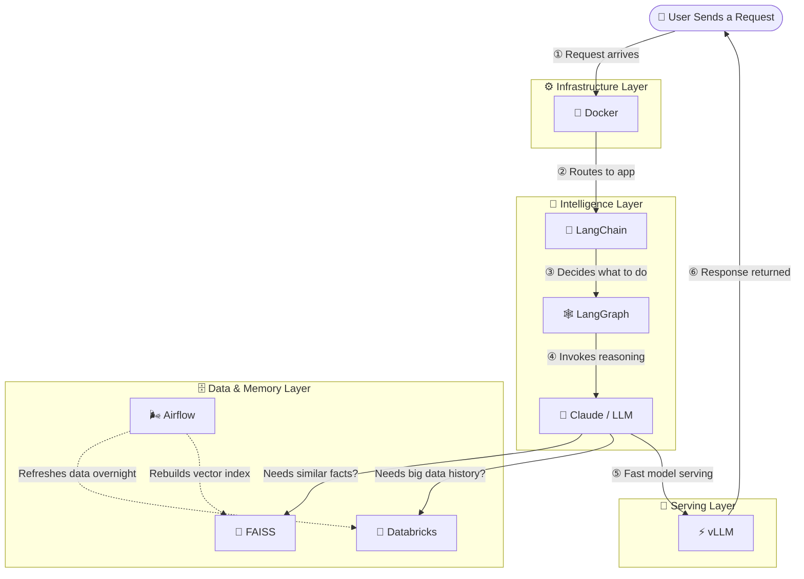

# 🏗️ Modern AI Architecture — 8 Essential Tools for 2026

An interactive visual guide to the modern AI engineering stack, designed for
**Software Architects, Technical Leads, and Engineering Managers**.

Plain-English explanations, validated performance numbers, real-world analogies,
and a full architecture diagram showing how all 8 tools connect.

🔗 **Live demo:** [yourusername.github.io/ai-architecture-2026](https://yourusername.github.io/ai-architecture-2026)

---

## 🧩 What's covered

The 8 tools are grouped into three architectural layers:

### 🧠 Intelligence Layer — The Brain
| Tool | Role |
|------|------|
| **Claude (Anthropic)** | Core LLM reasoning engine — 200k token context window |
| **LangChain** | Orchestration framework — connects AI to databases, APIs and tools |
| **LangGraph** | Stateful agent workflows — loops, retries and multi-step decisions |

### 🗄️ Data & Memory Layer — The Knowledge
| Tool | Role |
|------|------|
| **FAISS** | Vector similarity search — millisecond retrieval across millions of records |
| **Databricks** | Petabyte-scale data lakehouse — storage, ETL and ML training |
| **Apache Airflow** | Pipeline orchestrator — keeps all data fresh on schedule |

### ⚙️ Infrastructure Layer — The Engine Room
| Tool | Role |
|------|------|
| **vLLM** | High-throughput LLM serving engine — up to 24× faster than standard HuggingFace |
| **Docker** | Containerisation — packages the entire stack for consistent deployment anywhere |

---

## 📐 Architecture Diagram



---

## ✅ Validated Performance Numbers

| Tool | Metric | Source |
|------|--------|--------|
| **vLLM** | Up to **24×** higher throughput vs. HuggingFace Transformers | UC Berkeley SOSP '23 paper |
| **Databricks Photon** | **3–10×** query speedup vs. standard Spark | SIGMOD '22 paper + Databricks docs |
| **Apache Airflow** | **150,000+** daily task executions in production | Shopify Engineering Blog |
| **FAISS** | Searches **1 billion** vectors in milliseconds | Meta AI Research |

---

## 🚀 How to use locally

No build step required. It is a single self-contained HTML file.

```bash
# Clone the repo
git clone https://github.com/yourusername/ai-architecture-2026.git

# Open directly in your browser
open index.html
```

Or just visit the live URL above.

---

## 🗂️ Repo structure

```
ai-architecture-2026/
├── index.html      # The entire interactive deck — single file, no dependencies
└── README.md       # This file
```

All dependencies (Mermaid.js, Inter font) are loaded from public CDNs.
No npm install, no build pipeline, no framework.

---

## 🔗 Additional Resources

| Tool | Docs | GitHub |
|------|------|--------|
| vLLM | [vllm.ai](https://vllm.ai) | [github.com/vllm-project/vllm](https://github.com/vllm-project/vllm) |
| Claude | [docs.anthropic.com](https://docs.anthropic.com) | — |
| LangChain | [python.langchain.com](https://python.langchain.com/docs) | [github.com/langchain-ai/langchain](https://github.com/langchain-ai/langchain) |
| LangGraph | [langchain-ai.github.io/langgraph](https://langchain-ai.github.io/langgraph/) | [github.com/langchain-ai/langgraph](https://github.com/langchain-ai/langgraph) |
| Databricks | [docs.databricks.com](https://docs.databricks.com) | — |
| FAISS | [faiss.ai](https://faiss.ai) | [github.com/facebookresearch/faiss](https://github.com/facebookresearch/faiss) |
| Docker | [docs.docker.com](https://docs.docker.com) | — |
| Apache Airflow | [airflow.apache.org](https://airflow.apache.org) | [github.com/apache/airflow](https://github.com/apache/airflow) |

---

## 👤 Author

**Sadot Azulay** — Senior Software & Systems Architect  
Specialising in distributed systems, event-driven microservices and financial technology platforms.

- 🌐 [[sarefin-dev.github.io](https://[sarefin-dev.github.io](https://sarefin-dev.github.io/sarefin-dev))](https://sarefin-dev.github.io/sarefin-dev)
- 💼 [[linkedin.com/in/sadot.arefin](https://linkedin.com/in/your-handle)](https://bd.linkedin.com/in/sadotarefin)
- 📧 arefin.sadot@email.com

---

## 📄 License

MIT — free to use, share and adapt with attribution.
